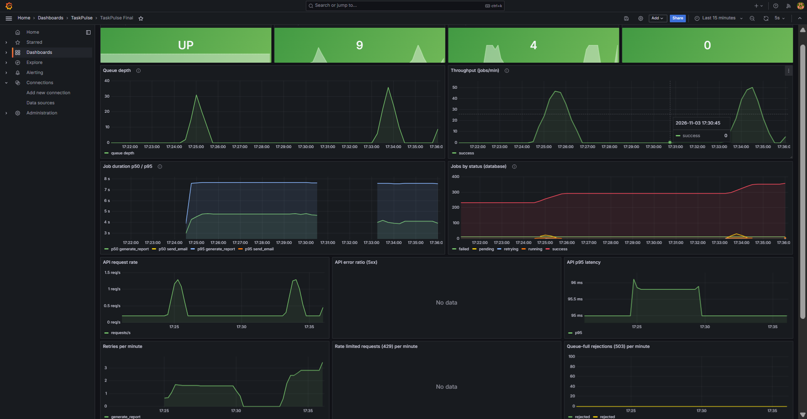
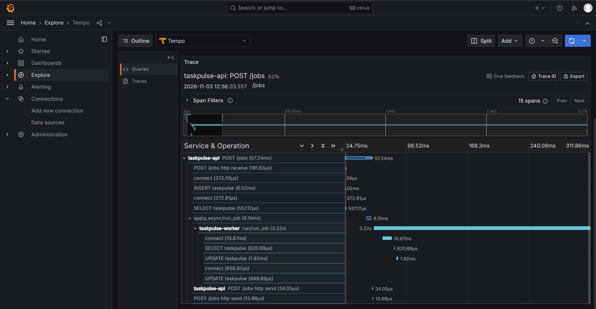
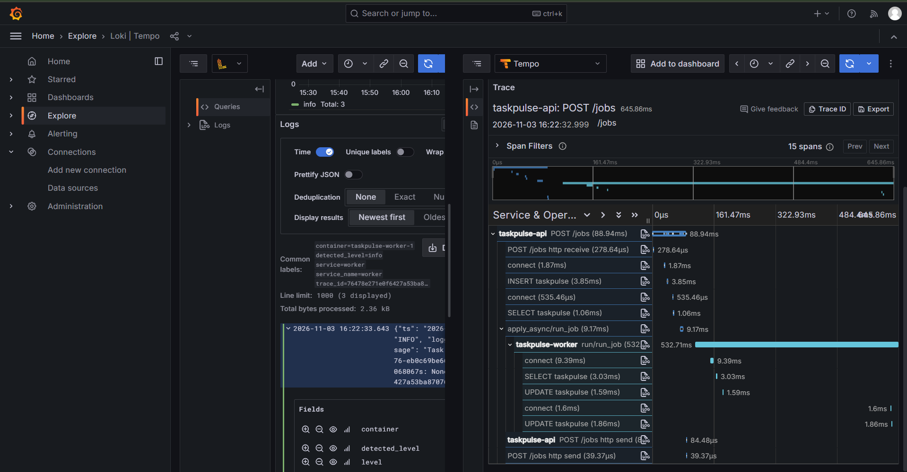
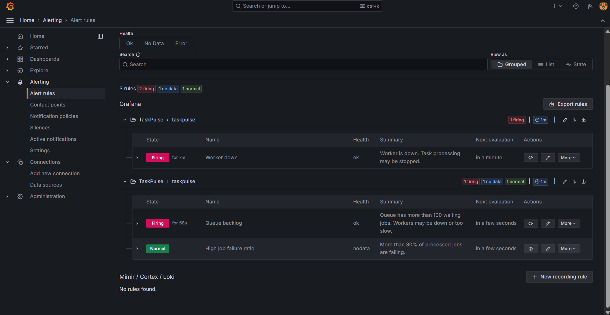
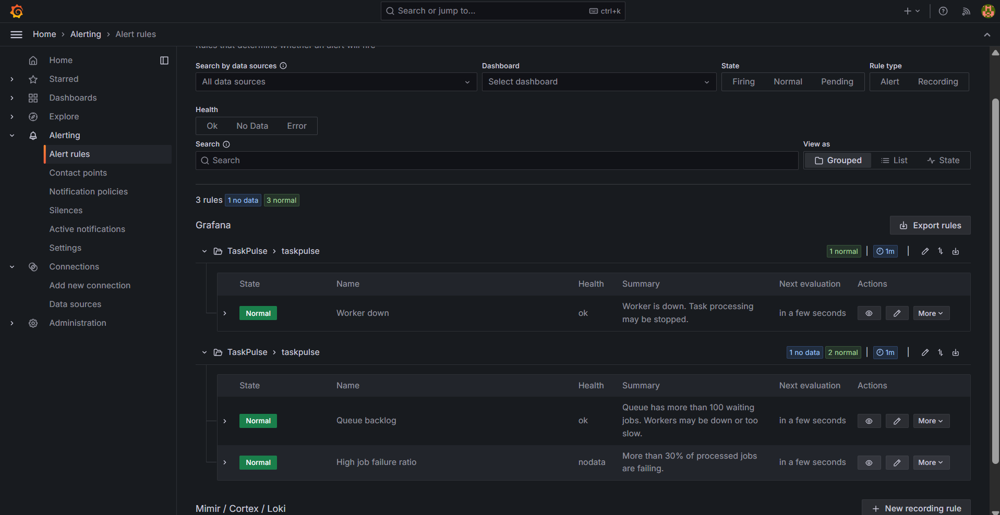
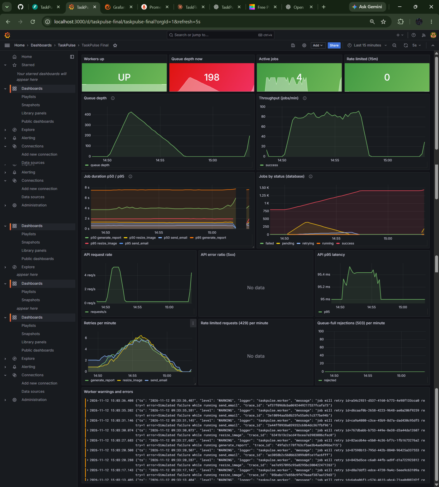
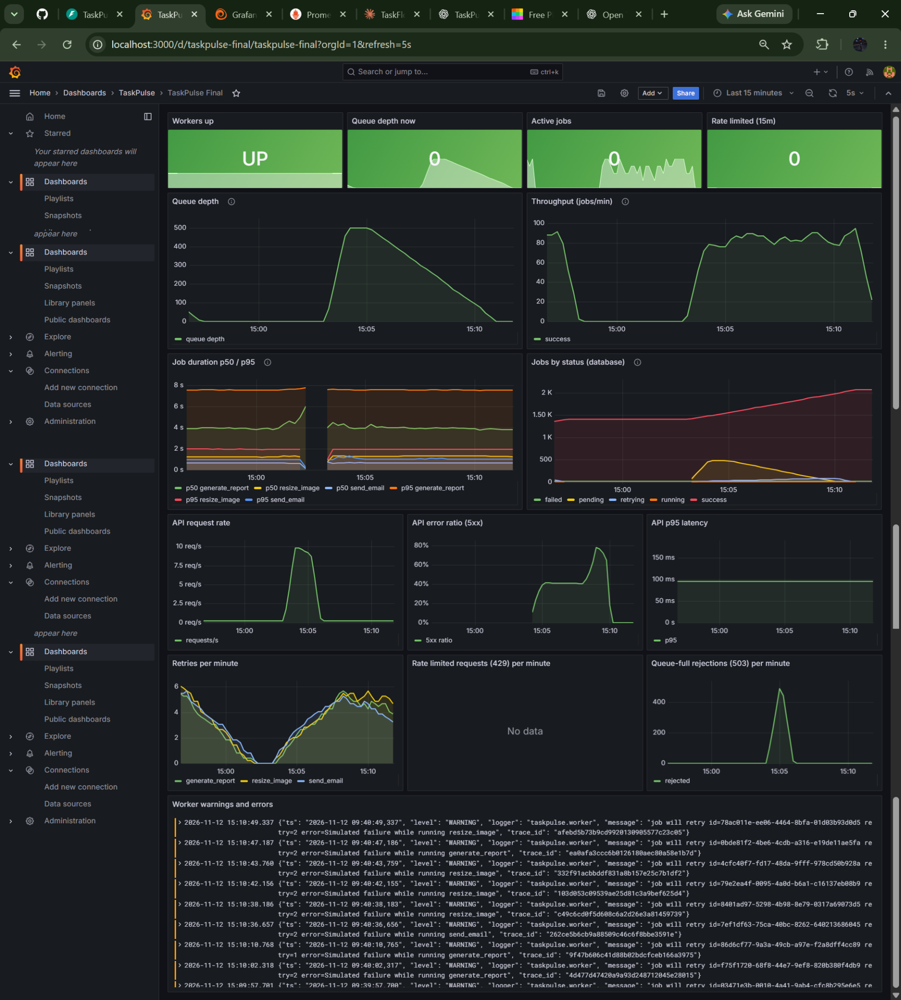
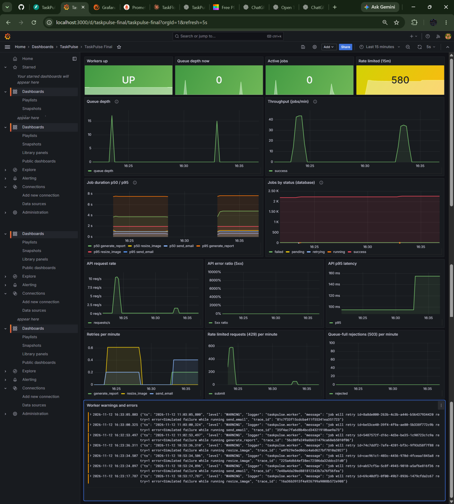
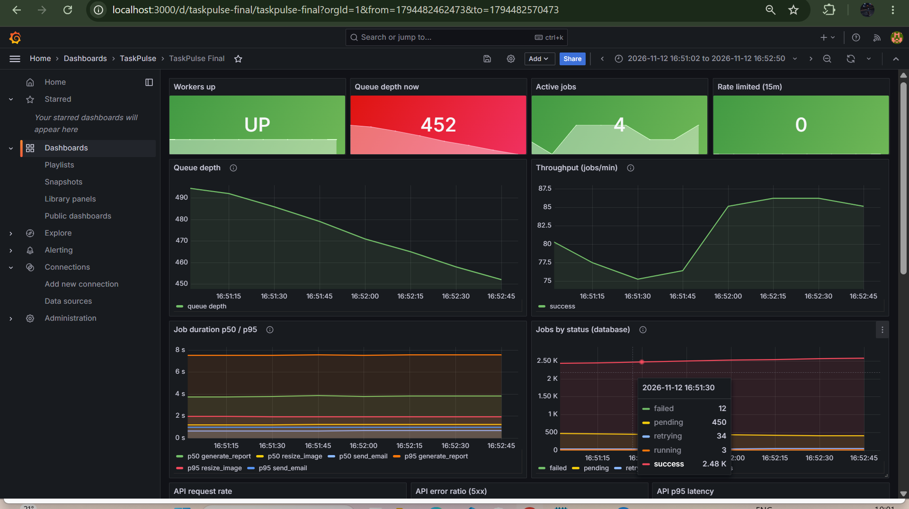

# TaskPulse

Distributed job processing platform with full observability: metrics, logs and traces, linked together in Grafana, with alerting. Load tested with k6 and failure tested with a worker crash.

## Stack
FastAPI, Celery, Redis, PostgreSQL, Prometheus, Loki, Grafana Alloy, Tempo, OpenTelemetry, Grafana, k6, Docker Compose

## Features
- Submit background jobs over HTTP (202 Accepted)
- Celery workers with retries and exponential backoff (2s, 4s, 8s)
- Job status tracking in PostgreSQL (pending, running, retrying, success, failed)
- Manual retry for failed jobs
- Per-client rate limiting (HTTP 429 with Retry-After)
- Queue backpressure (HTTP 503 when the queue is full)
- Prometheus metrics and a provisioned Grafana dashboard (queue depth, throughput, job duration, errors)
- Structured JSON logs shipped to Loki and searchable in Grafana
- Distributed tracing with OpenTelemetry and Tempo (API, queue, worker and database in one trace)
- Logs and traces linked by trace ID in Grafana, in both directions
- Grafana alert rules for queue backlog, worker down and a high job failure ratio
- k6 load tests: steady load, rate limiting and a traffic spike
- Failure testing with a written incident report (see [Failure testing](#failure-testing))

## Architecture


The same flow as text:
```
Client --> FastAPI (rate limit, save job) --> Redis queue --> Celery worker
                |                                                  |
                +------------------> PostgreSQL <------------------+

Metrics: API :8000/metrics and worker :8001/metrics --> Prometheus --> Grafana
Logs:    container stdout (JSON) --> Grafana Alloy --> Loki ------> Grafana
Traces:  OpenTelemetry (API and worker) --> Tempo ----------------> Grafana
```

## API
| Method | Endpoint | Purpose |
|---|---|---|
| POST | /jobs | Submit a job (response includes its `trace_id`) |
| GET | /jobs | List jobs, filter by status |
| GET | /jobs/{id} | Job details |
| POST | /jobs/{id}/retry | Retry a failed job |
| GET | /health | Health check |
| GET | /metrics | Prometheus metrics |

Job types: `generate_report`, `send_email`, `resize_image`.

## Rate limits
| Scope | Default | Environment variable |
|---|---|---|
| Submit jobs | 30 per minute per client | `RATE_LIMIT_SUBMIT` |
| Read jobs | 300 per minute per client | `RATE_LIMIT_READ` |
| Retry jobs | 10 per minute per client | `RATE_LIMIT_RETRY` |
| Queue length before HTTP 503 | 500 | `MAX_QUEUE_DEPTH` |

Clients are identified by the `X-API-Key` header, or by IP address if there is no header.
The limiter is a fixed-window counter in Redis. If Redis is down it fails open, so users are not blocked.

## Configuration
Set in `.env` (see `.env.example`).

| Variable | Purpose |
|---|---|
| `RATE_LIMIT_WINDOW_SECONDS` | Length of the rate limit window |
| `TASK_RATE_LIMIT` | Worker throttle, for example `120/m` |
| `FAILURE_RATE` | Share of simulated job failures (for failure testing) |
| `EXTRA_LATENCY_SECONDS` | Extra delay added to every job (for slowness testing) |

The Celery broker visibility timeout is set in `app/celery_app.py` (`broker_transport_options`, 120 seconds). See [Failure testing](#failure-testing) for why.

## Run
```
copy .env.example .env
docker compose up --build -d
```
(On Mac/Linux use `cp` instead of `copy`.)

Open http://localhost:8000/docs and submit a job.

## Tests
```
docker compose exec api pytest -q
```

## Project structure
```
taskpulse/
├── docker-compose.yml          # runs all 9 containers
├── Dockerfile                  # one image used by api AND worker
├── requirements.txt
├── .env.example                # copy to .env
├── .env                        # settings (not committed to git)
├── .gitignore
├── README.md
├── app/
│   ├── __init__.py
│   ├── main.py                 # FastAPI app, /health, /metrics
│   ├── config.py               # reads settings from environment
│   ├── database.py             # SQLAlchemy engine and session
│   ├── models.py               # Job table
│   ├── schemas.py              # request/response validation
│   ├── routes.py               # /jobs endpoints
│   ├── rate_limiter.py         # Redis rate limiting (429)
│   ├── celery_app.py           # Celery config + worker startup hook
│   ├── tasks.py                # the job logic, retries, failures
│   ├── metrics.py              # Prometheus metrics
│   ├── logging_config.py       # JSON logs with trace_id
│   └── telemetry.py            # OpenTelemetry setup
├── tests/
│   ├── __init__.py
│   └── test_api.py
├── observability/
│   ├── prometheus/
│   │   └── prometheus.yml
│   ├── tempo/
│   │   └── tempo.yml
│   ├── alloy/
│   │   └── config.alloy        # ships container logs to Loki
│   └── grafana/
│       ├── provisioning/
│       │   ├── datasources/datasources.yml
│       │   └── dashboards/dashboards.yml
│       └── dashboards/
│           └── taskpulse.json  # exported from Grafana
├── loadtest/
│   ├── baseline.js             # steady load at a chosen rate
│   ├── rate_limit.js           # one abusive client, one normal client
│   └── spike.js                # sudden traffic spike and recovery
└── docs/
    ├── architecture.png        # architecture diagram
    ├── incident-report.md      # jobs stuck after a worker crash
    ├── worker-kill-evidence.txt  # raw output of that test
    └── screenshots/            # images used in this README
```

## Observability

### Metrics
Prometheus scrapes metrics from the API (`:8000/metrics`) and the worker (`:8001/metrics`).
The Grafana dashboard is loaded automatically from `observability/grafana/dashboards/taskpulse.json`.
It shows worker status, queue depth, throughput, job duration (p50 and p95), jobs by status, API request rate, error ratio and latency, retries, rate limited requests, and recent worker warnings.



### Logs
Structured JSON logs are shipped to Loki by Grafana Alloy and searched in Grafana Explore.
This is the full history of one job: submitted, failed three times with exponential backoff, then succeeded.


Useful queries:
```
{service="worker"} | json | level="WARNING"
{service=~"api|worker"} |= "JOB-ID"
```

### Traces
OpenTelemetry traces go to Tempo. One trace follows a job from the API, through the Redis queue, into the worker and the database.
The API answers in under 100 ms while the job runs in the background, and the trace shows where every millisecond went.



To find a trace, copy the `trace_id` from the `POST /jobs` response, open Grafana, go to Explore, choose Tempo, and paste it in the TraceQL tab.

### Logs and traces linked
Every JSON log line carries the `trace_id` of the request it belongs to, and Grafana links the two in both directions.
Click **View trace** on a log line to open its trace:



Click the log icon on a span to see every log line of that trace:


### Alerts
Alert rules are defined in Grafana (Alerting, Alert rules) and evaluated every minute.

| Alert | Query | Condition | Pending |
|---|---|---|---|
| Queue backlog | `max(taskpulse_queue_depth)` | above 100 | 2 min |
| Worker down | `min(up{job="worker"})` | below 1 | 1 min |
| High job failure ratio | `sum(rate(taskpulse_jobs_processed_total{status="failed"}[5m])) / sum(rate(taskpulse_jobs_processed_total[5m]))` | above 0.3 | 2 min |

To test them, stop the worker and send jobs:
```
docker compose stop worker
```
The "Worker down" and "Queue backlog" alerts go from Pending to Firing:



After `docker compose start worker` the queue drains and both alerts return to Normal:



### Services
| Service | URL |
|---|---|
| API docs | http://localhost:8000/docs |
| Prometheus | http://localhost:9090 |
| Grafana | http://localhost:3000 (default login `admin` / `admin`, set in `.env`) |
| Loki | http://localhost:3100 |
| Tempo | http://localhost:3200 |

## Load tests
The load tests use [k6](https://grafana.com/docs/k6/latest/set-up/install-k6/) and run from the host against `http://localhost:8000`. Change the target with `-e BASE_URL=...`.
In all three scripts the HTTP statuses 202, 429 and 503 count as expected answers. Any other status is counted in `jobs_unexpected_status`, and the test fails if that counter is above zero.

| Script | What it does | How to run | Passes when |
|---|---|---|---|
| `baseline.js` | Constant request rate. Every request uses a new `X-API-Key`, so the rate limiter does not interfere. | `k6 run -e RATE=5 loadtest/baseline.js` (`RATE` default 1 per second, `DURATION` default 2m) | p95 under 500 ms, p99 under 1000 ms, at least 99% of requests accepted (202), no unexpected status |
| `rate_limit.js` | One client sends far above the limit while a second client with its own key stays below it. | `k6 run loadtest/rate_limit.js` (`RATE` default 20 per second, `DURATION` default 30s) | The limiter returns 429 to the abusive client, and at least 99% of the normal client's requests are accepted |
| `spike.js` | 1 request/s, then a sudden jump to `PEAK` (default 100/s) in 10 s, held for 1 minute, then back to 1/s for `RECOVERY` (default 5m). About 6m50s in total. | `k6 run loadtest/spike.js` (use `-e PEAK=50` on a slow machine) | p95 under 2 s, no unexpected status, fewer than 50 dropped iterations |

### What the tests showed
- **Worker capacity.** Grafana showed the worker finishing about **85 jobs per minute** (about 1.4 jobs per second, 4 jobs at a time). Any sustained submit rate above that makes the queue grow.
- **Spike test (PEAK=100).** k6 completed 7,320 requests with none interrupted. Queue depth rose to about 495, just under the limit of 500, and the workers stayed UP. No rate limit (429) appeared, because every request used its own key. Afterwards the queue drained on its own and the database showed no pending or running jobs.

### Screenshots

**Baseline, 1 request per second**


**Baseline, 5 requests per second**


**Baseline, 10 requests per second**





**Dashboard during baseline testing**




**Rate limit test**


**Spike test**



## Failure testing
The worker container was killed during a 6 minute k6 run (2 requests per second) and started again after a few minutes.

- **While the worker was down:** the API kept answering, with **p95 20.87 ms and p99 27.73 ms** over 721 requests (715 accepted, 2 rejected with 503 when the queue reached its limit, 4 connection errors). The queue grew to about 500, and the Workers up panel showed DOWN.
- **After the worker came back:** throughput returned to about 85 jobs per minute and the queue drained.
- **Problem found:** 4 jobs stayed stuck (3 `running`, 1 `pending`) after the queue was empty, and the dashboard showed 0 active jobs. They were not lost from the database, but nothing was going to run them for up to an hour. With Redis as the broker and `acks_late` enabled, messages held by a dead worker only return to the queue after the visibility timeout, which defaults to 1 hour.
- **Fix:** `broker_transport_options={"visibility_timeout": 120}` in `app/celery_app.py`. After rebuilding, the 4 stuck jobs finished and `unacked` went back to 0. This was confirmed on those 4 jobs; a second worker kill after the fix has not been run yet.


Full write-up with timeline, root cause and action items: [docs/incident-report.md](docs/incident-report.md). Raw output of the test: [docs/worker-kill-evidence.txt](docs/worker-kill-evidence.txt).

## Roadmap
- "Stuck jobs" dashboard panel and alert (jobs in `running` or `pending` for more than 5 minutes)
- Re-run the worker kill test after the visibility timeout fix, with a load below worker capacity
- Make tasks safe to run twice (a recovered job can run again with `acks_late`)
- Redis and PostgreSQL outage simulations
- Find the cause of the connection EOF errors seen by k6
- Pin dependency versions in `requirements.txt`